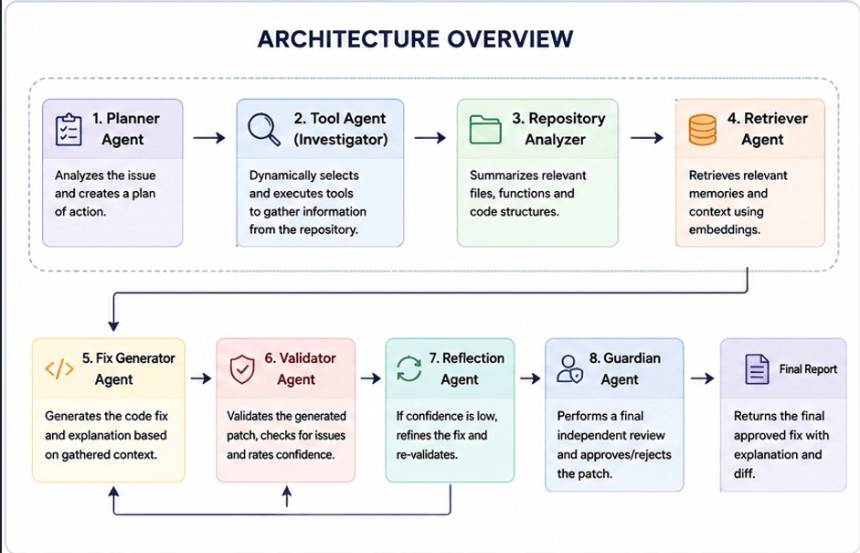
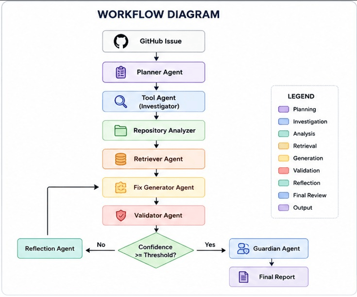
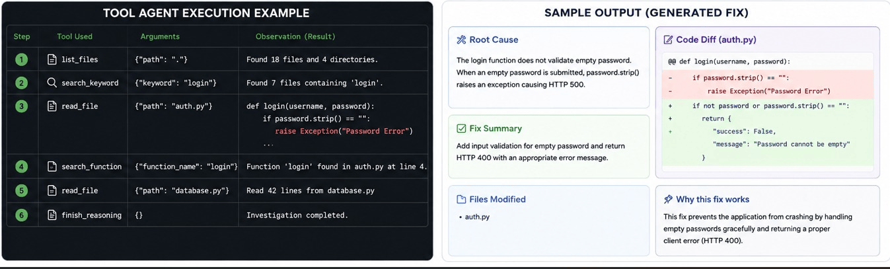

# 🚀 GitHub Issue Solver

> An autonomous multi-agent AI system that analyzes GitHub issues, investigates repositories using dynamic tool selection, retrieves relevant context, and generates validated code fixes.


---

## 📖 Overview

**GitHub Issue Solver** is an intelligent multi-agent system designed to automate the process of understanding and resolving software issues.

Instead of relying on a fixed workflow, the system dynamically selects repository investigation tools, analyzes the codebase, retrieves relevant information, generates potential fixes, validates them, and performs a final review before producing a solution.

The project demonstrates how Large Language Models (LLMs) can collaborate with repository analysis tools to simulate the workflow of an experienced software engineer.

---

## ✨ Features

- 🧠 Multi-Agent Architecture
- 🔍 Dynamic Tool Selection
- 📂 Repository Analysis
- 📄 Intelligent File Reading
- 🔎 Function & Keyword Search
- 🗂️ Semantic Memory using FAISS
- 🤖 LLM-based Patch Generation
- ✅ Automated Validation
- 🛡️ Guardian Review Agent
- 📊 Execution Logging
- 🔁 Reflection & Self-Correction

---

# 🏗️ Architecture

The system consists of multiple specialized AI agents.

```
GitHub Issue
      │
      ▼
Planner Agent
      │
      ▼
Tool Agent
      │
      ▼
Repository Analyzer
      │
      ▼
Retriever Agent
      │
      ▼
Fix Generator
      │
      ▼
Validator
      │
      ▼
Reflection Agent
      │
      ▼
Guardian Agent
      │
      ▼
Final Solution
```

---

# 🔄 Workflow

1. User submits a GitHub issue.
2. Planner Agent creates an investigation strategy.
3. Tool Agent dynamically selects repository tools.
4. Repository is explored.
5. Relevant context is retrieved.
6. LLM generates a software patch.
7. Validator evaluates the generated fix.
8. Reflection Agent improves low-confidence fixes.
9. Guardian Agent performs the final review.
10. Final solution is returned.

---

# 🛠️ Repository Tools

The Tool Agent can autonomously choose from the following repository tools:

| Tool | Purpose |
|------|---------|
| `list_files()` | Explore repository structure |
| `read_file()` | Read file contents |
| `search_keyword()` | Search keywords across repository |
| `search_function()` | Locate function definitions |
| `search_imports()` | Inspect project dependencies |
| `finish_reasoning()` | End investigation |

---

# 📁 Project Structure

```
GitHub-Issue-Solver/

│
├── GitHub_issue_Solver.ipynb
├── sample_repo/
│   ├── app.py
│   ├── auth.py
│   ├── database.py
│   ├── models.py
│   ├── utils.py
│   └── README.md
│
├── screenshots/
│   ├── architecture.png
│   ├── workflow.png
│   └── output.png
│
├── requirements.txt
├── LICENSE
└── README.md
```

---

# ⚙️ Installation

Clone the repository.

```bash
git clone https://github.com/YOUR_USERNAME/GitHub-Issue-Solver.git

cd GitHub-Issue-Solver
```

Install dependencies.

```bash
pip install -r requirements.txt
```

---

# ▶️ Running the Project

Open the notebook.

```
GitHub_issue_Solver.ipynb
```

Run all notebook cells.

Provide a GitHub issue such as:

```text
Title: Login endpoint crashes on empty password

Description:

Submitting an empty password returns HTTP 500.

Expected:
HTTP 400

Observed:
HTTP 500
```

The system will automatically:

- Plan investigation
- Explore repository
- Read relevant files
- Generate a patch
- Validate the fix
- Produce the final report

---

# 📊 Example Output

```
Planner Output

↓

Repository Investigation

↓

Generated Patch

↓

Validation Report

↓

Guardian Review

↓

Final Solution
```

---

# 📸 Project Screenshots

## 🏗️ Architecture Overview

<p align="center">
  
</p>

---

## 🔄 Workflow Diagram

<p align="center">
  
</p>

---

## 🤖 Sample Output

<p align="center">
  
</p>

# 💻 Technologies Used

- Python
- Groq API
- FAISS
- Sentence Transformers
- NetworkX
- Matplotlib
- GitPython
- NumPy
- Pandas

---

# 🎯 Future Improvements

- GitHub API Integration
- Automatic Pull Request Generation
- Multi-Repository Support
- Docker Deployment
- Web Interface using Streamlit
- Support for Multiple LLM Providers
- Unit Test Generation
- Continuous Repository Learning

---

# 📄 License

This project is licensed under the MIT License.

---

# 👨‍💻 Author

**Guru Divyansh**

Engineering Student | AI & Machine Learning Enthusiast

GitHub:
https://github.com/Guru3536

---

## ⭐ Support

If you found this project useful, consider giving it a ⭐ on GitHub!

Contributions, suggestions, and improvements are always welcome.
